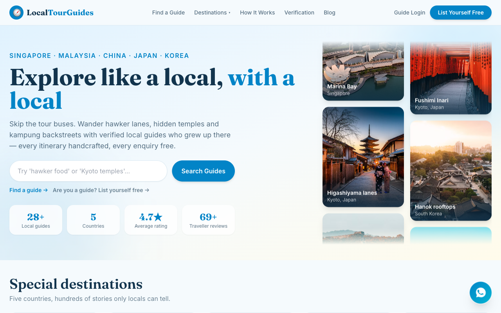

# 🧭 LocalTourGuides

A full-stack marketplace connecting travellers with **verified local tour guides** across Singapore, Malaysia, China, Japan and South Korea. Guides publish their itineraries; travellers browse, compare and send free enquiries through the portal.

## Live Demo

**https://localtourguides.tertiaryinfotech.com**



## Features

- **Sky-blue travel design** — soothing blues with warm sunset accents, photography-forward cards, auto-scrolling destination collage in the hero, fully responsive
- **Special destinations** — Singapore 🇸🇬, Malaysia 🇲🇾, China 🇨🇳, Japan 🇯🇵, South Korea 🇰🇷 with signature spots
- **Featured tours & featured guides** — handcrafted itineraries ranked to the top of the homepage and every search
- **28 seeded guides** (20 from Singapore) each with a full itinerary timeline, star ratings and reviews
- **Trust-first search ranking** — Featured → Verified → rating, on every search
- **Verification flow** — selfie + NRIC upload → live online interview → green ✓ badge (documents are private, never displayed or served publicly)
- **Free guide accounts** — profile + one itinerary, enquiries inbox in the dashboard
- **Enquiry portal** — travellers contact guides without exposing anyone's personal details
- **The Travel Table blog** — 30 posts with categories and social share buttons
- **Lead magnet** — free "48 Hours Like a Local" city-guide email capture with social share
- **WhatsApp floating widget** — wa.me/6588666375 on every page
- **Admin console** — verification approval queue and featured toggles
- **REST API** — clean JSON API ready for the future iOS/Android apps
- **No faces policy** — all public imagery shows destinations, never portrait photos

## Tech Stack

| Layer      | Tech |
|------------|------|
| Frontend   | React 18 · Vite · TypeScript · Tailwind CSS · React Router |
| Backend    | Node.js · Express · JWT · Multer |
| Database   | PostgreSQL in production (`DATABASE_URL`) · SQLite fallback for zero-setup local dev |
| Deployment | Docker · Coolify (auto-deploy on push to `main` via GitHub webhook) |

## Getting Started

```bash
# install everything
npm install
npm install --prefix server
npm install --prefix client

# run both servers (API on :4000, client on :5173)
npm run dev
```

Open http://localhost:5173. With no `DATABASE_URL` set, a local SQLite database is created and seeded automatically on first boot (28 guides, 30 blog posts, demo accounts). Set `DATABASE_URL=postgres://...` to run against PostgreSQL instead.

### Demo accounts

| Role  | Email | Password |
|-------|-------|----------|
| Guide | demo@localtourguides.com | guide123 |
| Admin | admin@localtourguides.com | admin123 |

### Useful scripts

```bash
npm run seed    # wipe and reseed the database (stop the dev servers first)
npm run build   # typecheck + production build of the client
npm start       # production: Express serves API + built client on :4000
```

## Deployment

Production runs on **Coolify**: a Dockerfile-built app container (Express serving the API and the built client) plus a managed **PostgreSQL** resource on the same project, reachable only over the internal Docker network. Every push to `main` triggers an automatic rebuild and deploy through a GitHub → Coolify webhook.

## Privacy

Guide personal data (NRIC, verification documents, contact details) is **never displayed publicly**, never included in public API responses, and the uploads directory is never served over HTTP. All traveller–guide communication flows through the enquiry portal.

## Project Structure

```
localtourguides/
├── client/                 # React + Vite + Tailwind frontend
│   └── src/
│       ├── components/     # Layout, WhatsApp widget, cards, badges, share
│       ├── pages/          # Home, Guides, Profile, Destinations, Blog, Dashboard, Admin…
│       ├── data/           # Destinations + hero collage content
│       └── lib/            # API client + auth context
├── server/                 # Express API
│   └── src/
│       ├── db.js           # Postgres/SQLite adapter, schema, auto-seed
│       ├── routes/         # public, auth, me (guide dashboard), admin
│       └── seed/           # 28 guides + itineraries + reviews, 30 blog posts
├── Dockerfile              # two-stage build (client build → runtime)
└── .claude/                # project skills, agents, commands and hooks
```

---

Powered by [Tertiary Infotech Academy Pte Ltd](https://www.tertiaryinfotech.com/)
